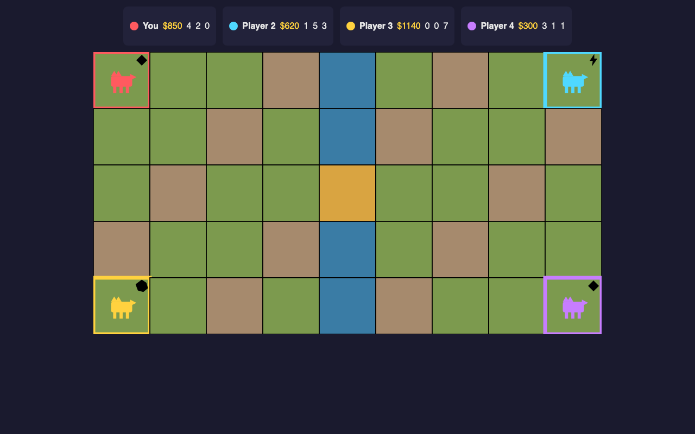
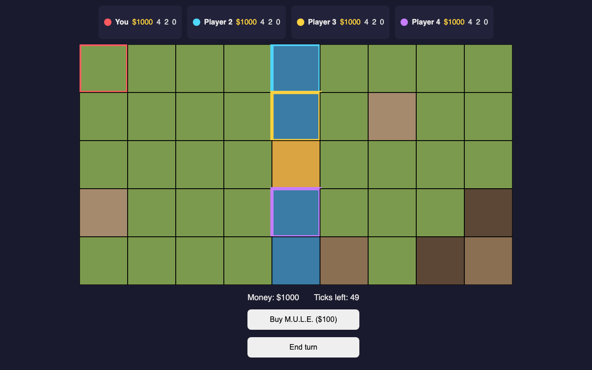
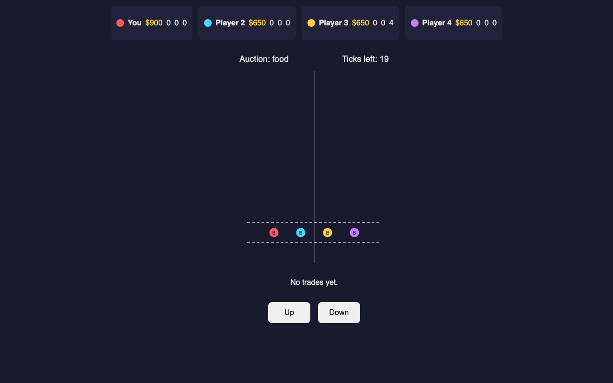

# M.U.L.E. Game

A browser remake of the 1983 economic strategy classic's core loop, for one human player against three AI opponents. Players claim land, place production robots, then trade food, energy, and ore in a real-time market auction.

## Features (v1 scope)

- 6-round beginner game session
- Land grant phase with snake-order plot picking
- M.U.L.E. purchase, outfitting, and placement on owned plots
- Production phase for food, energy, and smithore
- Real-time auction phase with live price bidding
- TypeScript and SVG rendering, deployable as a static site on GitHub Pages

Status: the core game loop is under active development; not all rounds and
phases are complete yet.

<!-- screenshots:begin (managed by screenshot-docs) -->




<!-- screenshots:end -->

## Quick start

```bash
npm run setup
./run_web_server.sh
```

Open the printed local URL in a browser to play. Before committing changes,
run the codebase checks:

```bash
./check_codebase.sh
```

## Testing

```bash
./check_codebase.sh
bash run_playwright_tests.sh
```

`check_codebase.sh` runs typecheck, ESLint, Prettier, and node unit tests.
`run_playwright_tests.sh` runs the browser test suite.

## Documentation

- [docs/CHANGELOG.md](docs/CHANGELOG.md): chronological record of changes
- [docs/CODE_ARCHITECTURE.md](docs/CODE_ARCHITECTURE.md): engine/AI/UI layer boundaries and data flow
- [docs/FILE_STRUCTURE.md](docs/FILE_STRUCTURE.md): directory map of the codebase
- [docs/INSTALL.md](docs/INSTALL.md): setup steps and environment requirements
- [docs/PLAYWRIGHT_USAGE.md](docs/PLAYWRIGHT_USAGE.md): browser test usage
- [docs/TODO.md](docs/TODO.md): backlog of deferred tuning and fidelity work
- [docs/USAGE.md](docs/USAGE.md): how to run the game and its scripts

## License

Source code is licensed under the MIT License; see
[LICENSE.MIT.md](LICENSE.MIT.md). Non-code creative assets are licensed under
CC BY 4.0; see [LICENSE.CC-BY-4.0.md](LICENSE.CC-BY-4.0.md).
