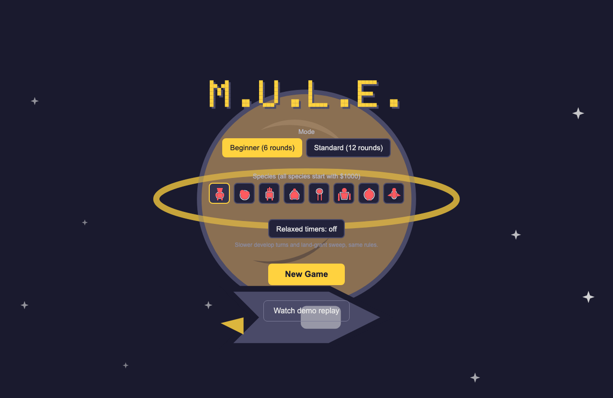
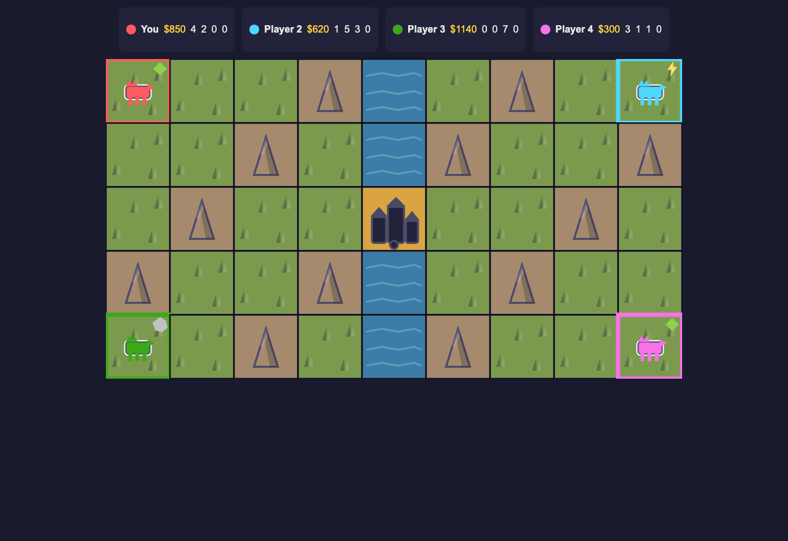
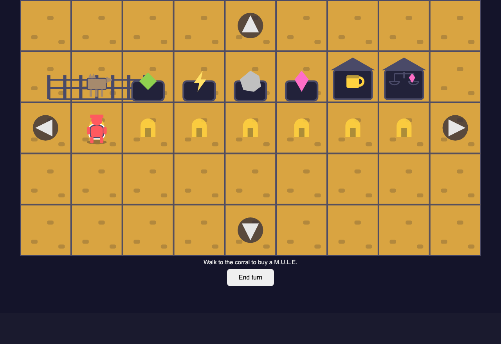
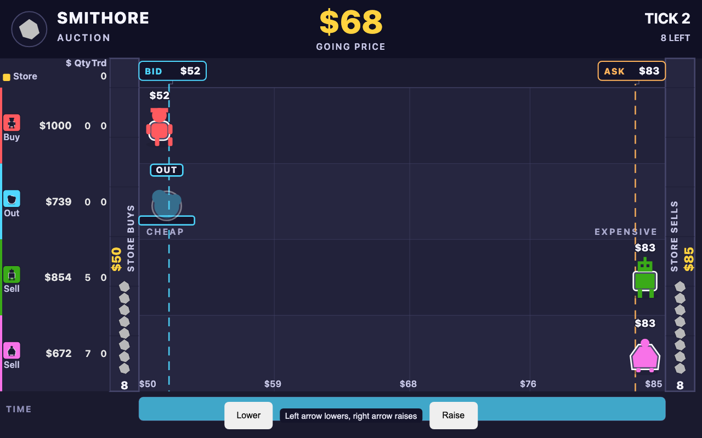
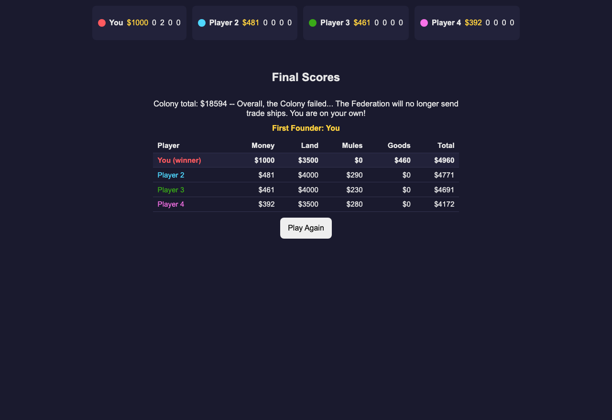

# M.U.L.E. Game

A browser remake of the 1983 economic strategy classic, for one human player against three AI opponents, with a walkable colony, live events, and land auctions layered onto the original claim-develop-trade loop.

## Features

- Land grant (snake-order plot picking) and colony land auctions for the plots left over
- A walkable overworld and town interior for buying, outfitting, and placing M.U.L.E.s,
  visiting the assay office, and encountering the wampus creature
- Personal and colony events each round (fortune, misfortune, and colony-wide effects)
- Production phase for food, energy, smithore, and crystite, then a real-time
  four-good auction with live price bidding
- End-of-game scoring with a colony rating and a First Founder callout
- Beginner (6-round) and standard (12-round) modes, with a species pick for
  the human player
- Keyboard and touch play (on-screen d-pad), a relaxed-timer option, and an
  accessibility pass (live status regions, focus management, reduced-motion
  support)
- The wampus creature and gambling at the pub, alongside the assay office
- Autosave and resume, a replay viewer for a committed demo game, three named
  AI personalities (land baron, ore speculator, farmer), first-run tutorial
  hints, ambient animation (reduced-motion aware), and installable offline
  (PWA) play
- SolidJS and SVG rendering, deployable as a static site on GitHub Pages

Status: a full game (New Game through scoring, both modes) plays start to
finish with an automated headless playthrough gate, and every release
balance/AI gate is green (see [docs/CHANGELOG.md](docs/CHANGELOG.md) for the
current numbers); a version bump for the release cut is pending.

<!-- screenshots:begin (managed by screenshot-docs) -->





<!-- screenshots:end -->

## Quick start

```bash
npm run setup
./run_web_server.sh
```

Open the printed local URL in a browser to play. Before committing changes,
run the codebase checks:

```bash
./check_codebase.sh
```

## Testing

```bash
./check_codebase.sh
bash run_playwright_tests.sh
```

`check_codebase.sh` runs typecheck, ESLint, Prettier, and node unit tests.
`run_playwright_tests.sh` runs the browser test suite.

## Documentation

### Getting started

- [docs/INSTALL.md](docs/INSTALL.md): setup steps and environment requirements
- [docs/USAGE.md](docs/USAGE.md): how to run the game and its scripts

### Architecture

- [docs/CODE_ARCHITECTURE.md](docs/CODE_ARCHITECTURE.md): engine/AI/UI layer boundaries and data flow
- [docs/FILE_STRUCTURE.md](docs/FILE_STRUCTURE.md): directory map of the codebase

### Testing

- [docs/PLAYWRIGHT_USAGE.md](docs/PLAYWRIGHT_USAGE.md): browser test usage

### Project notes

- [docs/CHANGELOG.md](docs/CHANGELOG.md): chronological record of changes
- [docs/RULE_SOURCES.md](docs/RULE_SOURCES.md): per-rule authority decisions where historical sources conflict
- [docs/REFERENCE_REPOS.md](docs/REFERENCE_REPOS.md): reference repos consulted for rules and data
- [docs/TODO.md](docs/TODO.md): backlog of deferred tuning and fidelity work

## License

Source code is licensed under the MIT License; see
[LICENSE.MIT.md](LICENSE.MIT.md). Non-code creative assets are licensed under
CC BY 4.0; see [LICENSE.CC-BY-4.0.md](LICENSE.CC-BY-4.0.md).
