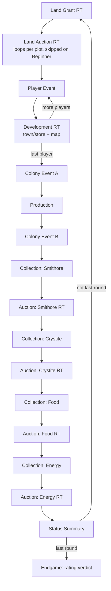

# Screen flowchart

## Context

This project is a from-scratch remake of the 1983 strategy game M.U.L.E. Before
we commit to a unique visual design for each of our own screens, we need a
shared map of what screens the game actually has, in what order they appear,
and what triggers each transition. This document is that map. It reconstructs
the screen flow from three faithful references and marks where they differ:

- **1983 original** - Ozark Softscape, Atari 8-bit and Commodore 64. Evidence
  from the Kroah reverse-engineering writeup (`OTHER_REPOS/mule_document.html`)
  and the disassembly (`OTHER_REPOS/MULE-assembly/MULE-Disassembled_Memory.asm`).
- **1990 NES port** - Mindscape. Evidence from screenshots captured locally
  (not committed to this repo; the console art is copyrighted). This port is
  mechanically faithful to the 1983 game and is our clearest source of legible
  per-screen art.
- **2011 Planet M.U.L.E.** - Turborilla networked remake. Evidence from the
  decompiled Java under `OTHER_REPOS/planet_mule/data_decompiled/`.

The companion document [SCREEN_DESIGNS.md](SCREEN_DESIGNS.md) covers the content
of each screen in detail (art, controls, and a compare-and-contrast per screen).
This document is the flow: boxes and arrows.

Note: `OTHER_REPOS/` is a local reference-only checkout and is not tracked in
this repo, so the paths above are cited as plain text rather than links.

## Versions at a glance

| | 1983 original | 1990 NES | 2011 Planet M.U.L.E. |
| --- | --- | --- | --- |
| Players | 1-4 (hotseat, shared screen) | 1-4 (hotseat) | 1-4 (networked + AI) |
| Rounds | 6 / 12 / 12 | 6 / 12 / 12 | configurable (~12) |
| Difficulties | Beginner / Standard / Tournament | Beginner / Standard / Tournament | Training / Tournament modes |
| Real-time phases | land grant, land auction, development, goods auction | same | same |
| Extra screens | none | none | login, lobby, connect, pause/reconnect, chat |

## Whole-game flow

One full game is a one-time setup, a repeating round loop, and a one-time
endgame. The round loop is where almost every screen lives.

```
  PRE-GAME (once)
  +-----------------------------------------------------------+
  |  Title / attract                                          |
  |     |                                                     |
  |     v                                                     |
  |  Player count  ->  Difficulty  ->  (per player) Color     |
  |                                        ->  Species        |
  |     |                                                     |
  |     v                                                     |
  |  Landing on planet Irata  (transport ship descends)       |
  |     |                                                     |
  |     v                                                     |
  |  Status Summary #0  (starting money / goods, colony total)|
  |     |                                                     |
  |     v                                                     |
  |  Ship departs  ("the ship will be back in N months")      |
  +-----------------------------------------------------------+
        |
        v
  ROUND LOOP  (repeat for round r = 1 .. R)   <-------------------+
  +-----------------------------------------------------------+   |
  |  see "Per-round flow" below                               |   |
  +-----------------------------------------------------------+   |
        |                                                         |
        |  r < R ?  yes ------------------------------------------+
        |
        |  r == R (last round)
        v
  ENDGAME (once)
  +-----------------------------------------------------------+
  |  Final Status Summary  ->  Colony rating verdict          |
  |     (highest score = "First Founder")                     |
  +-----------------------------------------------------------+
```

Planet M.U.L.E. wraps the same core with networking screens: a Swing **Login**
and **lobby browser** run before anything else, then an in-phase **Connect**
handshake and **Game Lobby** replace the plain title, and the landing/takeoff
is the reused **Intro** phase (landing on round 0, takeoff on round 1). A
**Pause / reconnect** screen can preempt any in-game phase on a disconnect.

## Per-round flow

Every round runs this sequence. Real-time (timed, joystick-driven) phases are
marked `[RT]`; the rest are animations or accounting the player watches.

```
  ROUND r
  +-----------------------------------------------------------------+
  |  1. Land Grant            [RT]  one free plot, first to claim   |
  |        |                                                        |
  |        v                                                        |
  |  2. Land Auction          [RT]  bid on plots (loops per plot)   |
  |        |                        (skipped on Beginner)           |
  |        v                                                        |
  |  3. per player, in reverse-rank order:                          |
  |     +-----------------------------------------------------+     |
  |     |  Player Event      random money/goods (about 1 in 4)|     |
  |     |     |                                               |     |
  |     |     v                                               |     |
  |     |  Development     [RT]  walk map + enter town/store: |     |
  |     |        buy + outfit a MULE, place it on a plot,     |     |
  |     |        assay (Tournament), hunt wampus, pub-gamble  |     |
  |     +-----------------------------------------------------+     |
  |        |                                                        |
  |        v                                                        |
  |  4. Colony Event A       pre-production random event (maybe)    |
  |        |                                                        |
  |        v                                                        |
  |  5. Production           plots convert energy into resources   |
  |        |                                                        |
  |        v                                                        |
  |  6. Colony Event B       post-production random event (maybe)   |
  |        |                                                        |
  |        v                                                        |
  |  7. Goods trading, per resource in fixed order:                 |
  |         Smithore -> Crystite -> Food -> Energy                  |
  |     +-----------------------------------------------------+     |
  |     |  Collection / Status   accounting: previous units, |     |
  |     |        usage, spoilage, production, surplus/short  |     |
  |     |     |                                               |     |
  |     |     v                                               |     |
  |     |  Auction          [RT]  declare buyer/seller, then |     |
  |     |        real-time price floor; buyers rise, sellers |     |
  |     |        fall, trade where they meet                 |     |
  |     +-----------------------------------------------------+     |
  |        (a resource is skipped when nobody has units to trade)   |
  |        |                                                        |
  |        v                                                        |
  |  8. Status Summary       ranked scoreboard, colony total       |
  +-----------------------------------------------------------------+
        |
        v
    next round (or endgame if last)
```

### Ordering note (original vs Planet M.U.L.E.)

The 1983 disassembly runs the round as: land grant, player land auction, colony
land auction, players' turn (development, with per-player events), production,
one **round event**, store repricing, four goods auctions, corral mule-building,
score. Planet M.U.L.E. splits the single round event into **Colony Event A**
(before production) and **Colony Event B** (after production), and interleaves
each resource's collection and auction. The player-visible sequence is the same
shape; the split is an implementation detail called out here so the two code
bases line up.

## Rendered flow (round loop)

The same round loop as a graph, for readers whose viewer renders Mermaid.



## How the rounds cycle

The round loop is not a fresh start each time - it is a single accumulating game
state revisited round after round. Three things make the cycle work:

### The Status Summary is the hinge

Every round ends on the **Status Summary**, and that same screen is the gateway
into the next round. When all players press continue on the Summary, the game
either starts the next round at **Land Grant** or, if this was the last round,
opens the **Endgame**. So the loop-back point is exactly one edge: Status Summary
-> next round's Land Grant.

```
   ... -> Goods trading -> Status Summary --(press continue)--+
                                |                             |
                                | last round                 | not last round
                                v                             v
                             Endgame                    next round: Land Grant
```

### The round counter decides when to stop

Rounds are numbered: round 0 is the landing briefing summary, and rounds 1..R are
the played rounds (R = 6 on Beginner, 12 on Standard and Tournament). After each
round's Summary the counter advances and is compared to R. In Planet M.U.L.E. this
is literally `SummaryPhase2.end()` calling `beginNextRound()`, with
`isLastRound()` = `round == lastRound`; in the 1983 disassembly the `round:`
driver loops while `numRound != nbRounds`. On the final round the Summary does not
loop - it becomes the Endgame and records the score.

There is also an **early exit**: if at the end of any round neither the players
nor the store hold any food or energy, the colony collapses and the game ends
immediately, regardless of the round number. So the loop terminates on either the
round count running out or colony failure.

### What carries across the loop

Each new round layers its phases on top of everything accumulated so far - the
cycle compounds, it does not reset:

- **Persists**: owned plots and their installed MULEs, each player's money and
  goods, the store's stock and its supply/demand-adjusted prices, and player rank
  (which drives grant/auction/turn order next round).
- **Resets each round**: the single free land grant, that round's random events,
  the development and auction time bars, and the per-resource declare/trade floor.

The `round:` driver in the disassembly is the authoritative encoding of this: it
re-enters land grant, development, production, events, and trade every iteration
while the persistent player and store records carry forward untouched.

### Round-0 special case (Planet M.U.L.E.)

The very first Summary (round 0, the landing briefing) does not go to Land Grant.
It loops back to the **Intro** phase for the ship **takeoff** animation, and only
then does round 1's Land Grant begin. Every later round's Summary goes straight to
the next Land Grant. This is why the Intro phase is visited exactly twice - once
to land (round 0), once to depart (round 1) - a detail worth knowing when tracing
the very start of the cycle.

## Transition triggers

What advances each screen. "All players ready" means every human presses their
button; real-time phases also end when their timer bar empties.

| Screen | Advances when |
| --- | --- |
| Title / setup screens | a selection is confirmed (button press) |
| Landing / takeoff | the ship animation completes |
| Status Summary #0 | all players press their button |
| Land Grant | the moving cursor finishes sweeping plots; each player claims by button; ties go to the lowest-ranked player |
| Land Auction | a plot sells or a colony plot goes unbought; loops once per plot offered |
| Player Event | short scripted message plays out; effect applied to that player |
| Development | the player's real-time bar empties or the player ends early at the pub; proceeds player by player |
| Colony Event A / B | the event animation completes (or is skipped if it does not apply this round) |
| Production | outputs finish ticking up; player may press to skip |
| Collection / Status | accounting animation finishes each resource |
| Auction (goods) | the auction timer expires; runs once per resource, skipped when no one can trade it |
| Status Summary | all players press to continue |
| Endgame | final continue; score is recorded |

## Difficulty and mode deltas

- **Beginner**: 6 rounds; **no land auctions** (a "no new plots for sale"
  notice replaces them); fixed prices and extra starting resources; no
  Crystite, no assay office.
- **Standard**: 12 rounds; land auctions active; faster cursors; pirates.
- **Tournament**: 12 rounds; adds the **Crystite** resource, so the
  Smithore -> Crystite -> Food -> Energy auction chain runs all four, and the
  town gains a **mining outfitting** shop plus assay office use.
- **Round R (final)**: the round event is always the **colony ship return**.

## Planet M.U.L.E. only screens

These have no equivalent in the 1983 or NES versions:

- **Login** and **lobby browser** (Swing windows) - account and game selection.
- **Connect** - server handshake and reconnect-token handling.
- **Game Lobby** - player cards, spectators, ready-up, and a vote on whether the
  gain/lose-plot events are enabled.
- **Pause / reconnect** - disconnect grace, vote-to-kick, AI takeover, resume
  countdown; can interrupt any in-game phase.
- **In-game chat** - overlaid on gameplay phases.

Planet M.U.L.E. also offers **single** (turn-based) versus **multi**
(simultaneous) development, and a **fast** development mode that auto-runs AI
turns without showing the walk. The 1983 and NES versions only have the
simultaneous-development model.

## See also

- [SCREEN_DESIGNS.md](SCREEN_DESIGNS.md) - per-screen content and the
  version-by-version compare and contrast, including the annotated goods-auction
  walkthrough.
- [RULE_SOURCES.md](RULE_SOURCES.md) - provenance of formulas and constants.
